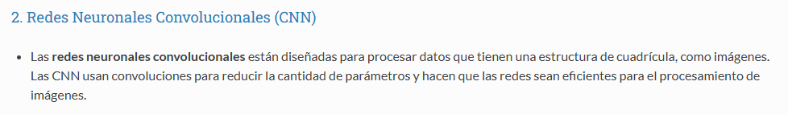
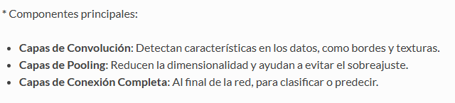

# Actividad 1 

### Modelar una red neuronal que pueda jugar al 5 en línea sin gravedad en un tablero de 20*20
- Definir el tipo de red neuronal y describir cada una de sus partes 
- Definir los patrones a utilizar 
- Definir la función de activación es necesaria para este problema 
- Definir el número máximo de entradas
- ¿Que valores a la salida de la red se podrían esperar?
- ¿Cuáles son los valores máximos que puede tener el bias?

#### Definir el tipo de red neuronal y describir cada una de sus partes
- Existen muchas opciones de tipos de redes neuronales que podríamos usar para resolver el problema, como en este caso el problema se puede basar más que nada en patrones debido a la complejidad del juego podríamos hacer uno de una red neuronal del tipo Convolucional(CNN), debido a que estas son usadas comúnmente para procesar datos que tienen una estructura de cuadrícula (Y en este caso estaríamos trabando con un tablero de 20*20).

**Anexo sobre Redes Neuronales del tipo Convolucional**

Con esto en claro, podemos definir cada una de sus partes basadas en la problematica
 
Primero, tenemos que recordar que esta red neuronal tiene como principales componentes lo siguiente:

Adaptada al problema podemos decir lo siguiente:
- **Capas de entrada:** En este caso la capa de entrada es el tablero de 20*20
- **Capas de Convolución:** Se pueden detectar en este caso los patrones de lineas dentro del tablero
- **Capas de Pooling:**  Para evitar el sobre ajuste se puede en este caso destacar lo mas importante (Como la cercania a una linea de 5 fichas)
- **Capas de Conexión Completa:** Tomar una decision basada en lo anterior, lo que permitira hacer una jugada
  
#### Definir los patrones a utilizar 

Como los principales patrones a utilizar tendríamos que recordar como es que funciona el juego de 5 en línea, en este caso son las jugadas propias, jugadas del oponente, cercanía a formar una línea sea vertical, horizontal o en diagonal, así también como los bloqueos que otros jugadores pueden hacer sobre nuestras líneas, con esto en consideración podemos definir los siguientes patrones.

- Jugadas individuales del jugador, usando posiciones de juego para asegurar que se formen líneas de 5 fichas para ganar 
- Líneas formadas por el jugador, sean verticales, horizontales o diagonales 
- Conjuntos de fichas (3 fichas en línea, 4 fichas en línea) cercanos al patrón de 5 fichas en línea 

#### Definir la función de activación es necesaria para este problema 

En este caso podriamos usar Softmax, pues bajo sus propiedades y caracteristicas podemos decir que se utilizará en la capa de salida para obtener una distribución de probabilidad sobre las posibles jugadas en el tablero.

#### Definir el número máximo de entradas

El numero maximo de entradas lo podemos entender de manera facil, en este caso es 20x20, lo que nos daria el equivalente a 400 entradas. 

# ¿Cuáles son los valores máximos que puede tener el bias?
# Bias es una neurona extra que te ghace convertir el valor 
 - Dependera de cuanto se desea minimizar el error, en este caso se ira ajustando entre valores hasta lograr un resultado esperado