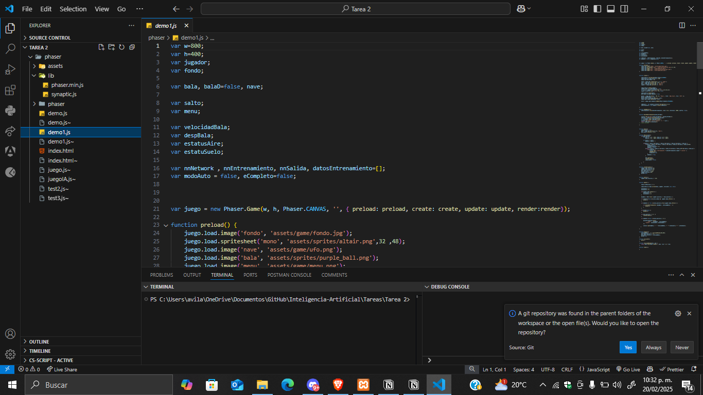

# Tarea 2

Inteligencia Artificial

Para esta tarea primero descargue el código de referencia que nos proporciono en el Dropbox, despues instale y configure XAMPP para poder montar el proyecto con apache y poder ejecutarlo para poder realizar las pruebas necesarias.



# **Análisis del Código**

En este caso el código contiene dos partes importantes, pero primero tenemos que explicar a grandes rasgos que es, en este caso primero podemos decir que es un juego bastante simple en el que el jugador tiene que esquivar balas  que un enemigo dispara, a simples rasgos esta el modo manual que es controlado por el jugador y el modo automático que es controlado por una red neuronal.

Primero podemos ver el entorno del juego y los controladores del ciclo de vida del juego.

```xml
var juego = new Phaser.Game(w, h, Phaser.CANVAS, '', { preload: preload, create: create, update: update, render: render });
```

En términos generales se crea el entorno de vida general del juego como las “Físicas” en el resto de los apartados del código, hasta llegar a la parte de la red neuronal.

**Red neuronal**

```xml
nnNetwork = new synaptic.Architect.Perceptron(2, 3, 3, 2);
nnEntrenamiento = new synaptic.Trainer(nnNetwork);
```

En este caso se crea una red neuronal con 2 entradas (distancia y velocidad de la bala), 3 neuronas en la capa oculta y 2 salidas (saltar o no saltar), despues se inicializa un entrenador para la red y se entrena para poder entender el juego mientras el jugador juega, asi cuando sea turno del modo automático pueda jugar solo.

Entonces, pasamos a la actividad de jugar y graficar los datos requeridos

## Graficas de la ejecución del juego


Aqui podemos ver la ejecución del juego, y los datos que vamos a graficar

**Grafica 1 - Modo Manual**

Aqui podemos ver la grafica de los puntos del modo manual donde las líneas discontinuas que se ven son los puntos en los que cambia de 0 a 1 el estado, y las azules completas son la secuencia en la que se sigue el formato de los puntos.


Aqui podemos ver como se comporta cuando el jugador “Salta” para esquivar las balas

**Grafica 2 - Modo Automático**

Para el caso del la grafica usando la red neuronal, se entreno al modelo con 447 valores, por los cuales podremos ver de manera un poquito mas clara como es que funciona la red con los valores que se entreno.


El análisis de ambas es un poco confuso, al principio vi demasiados datos de golpe pero al indagar un poco mas me di cuenta de que en el caso de la grafica manual los datos son un poco mas sencillos de entender, esto porque se ve de manera clara como son los cambios de estado dentro de lo que es el juego, y en el caso de la automática podemos ver lo que se entiende como “**salida de un modelo predictivo”**

De alguna forma esas diferencias son claras, y hasta cierto punto variables, demostrando claramente que en el modo manual todo es mas controlado por el usuario y en el caso del automático es todo mas sistemático